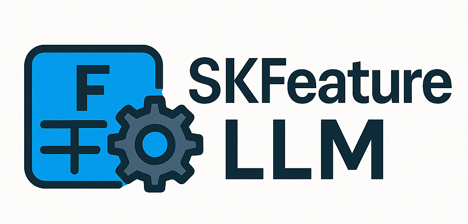

# SKFeatureLLM

<div align="center">
  
</div>

<div align="center">
  <a href="https://skfeaturellm.readthedocs.io/">
    
  </a>
  <a href="https://github.com/RobertoCorti/skfeaturellm/blob/feat/docs/LICENSE">
    
  </a>
  <a href="https://codecov.io/github/RobertoCorti/skfeaturellm" >
 
 </a>
</div>

SKFeatureLLM is a Python library that brings the power of Large Language Models (LLMs) to feature engineering for tabular data, wrapped in a familiar scikit-learn–style API. The library aims to leverage LLMs' capabilities to automatically generate and implement meaningful features for your machine learning tasks.

## 📑 Table of Contents

- [SKFeatureLLM](#skfeaturellm)
  - [📑 Table of Contents](#-table-of-contents)
  - [🌟 Key Features](#-key-features)
  - [📦 Installation](#-installation)
  - [📄 License](#-license)
  - [🤝 Contributing](#-contributing)
    - [Development Setup](#development-setup)
    - [Code Style](#code-style)
  - [👤 Author](#-author)
  - [📚 Documentation](#-documentation)

## 🌟 Key Features

- 🤖 LLM-powered feature engineering
- 🔌 Model-agnostic: works with any LLM provider (OpenAI, Anthropic, etc.)
- 🛠 Scikit-learn compatible API
- 📊 Comprehensive feature evaluation and reporting
- 🎯 Support for both supervised and unsupervised feature engineering


## 📦 Installation
To install the latest release of SKFeatureLLM from PyPI:

```bash
pip install skfeaturellm
```

This will install the library and its core dependencies for end users.

### ✅ Running Tests

To run the test suite, ensure pytest is installed and execute:

```bash
poetry run pytest
```

Tests are located in the `tests/` directory and cover the core functionality of SKFeatureLLM.


## 📄 License

This project is licensed under the MIT License - see the LICENSE file for details.

## 🤝 Contributing

We welcome contributions! Here's how you can help:

1. **Report Bugs**: If you find a bug, please open an issue with a detailed description.
2. **Suggest Features**: Have an idea for a new feature? Open an issue to discuss it.
3. **Submit Pull Requests**: We love PRs! Here's how to submit one:
   - Fork the repository
   - Create a new branch for your feature
   - Make your changes
   - Submit a pull request

### Development Setup

1. Clone the repository:
```bash
git clone https://github.com/yourusername/skfeaturellm.git
cd skfeaturellm
```

2. Install development dependencies:
```bash
pip install -e ".[dev]"
```

3. Run tests:
```bash
pytest
```

4. Format code:
```bash
black .
isort .
```

### Code Style

We use:
- Black for code formatting
- isort for import sorting
- pylint for linting
- mypy for type checking

Please ensure your code passes all checks before submitting a PR.

## 👤 Author

- **Roberto Corti** - [GitHub](https://github.com/RobertoCorti)
- **Stefano Polo** - [GitHub](https://github.com/stefano-polo)

## 📚 Documentation

Our documentation is hosted on Read the Docs and includes:

- 📖 [User Guide](https://skfeaturellm.readthedocs.io/en/latest/user_guide.html) - Learn how to use SKFeatureLLM effectively
- 🔍 [API Reference](https://skfeaturellm.readthedocs.io/en/latest/api_reference.html) - Detailed documentation of all classes and methods
- 🎯 [Examples](https://skfeaturellm.readthedocs.io/en/latest/examples.html) - Practical examples for different use cases
- 📊 [Feature Engineering Guide](https://skfeaturellm.readthedocs.io/en/latest/user_guide.html#feature-engineering) - Best practices for feature engineering with LLMs

For any questions or issues, please open an issue on our GitHub repository.
